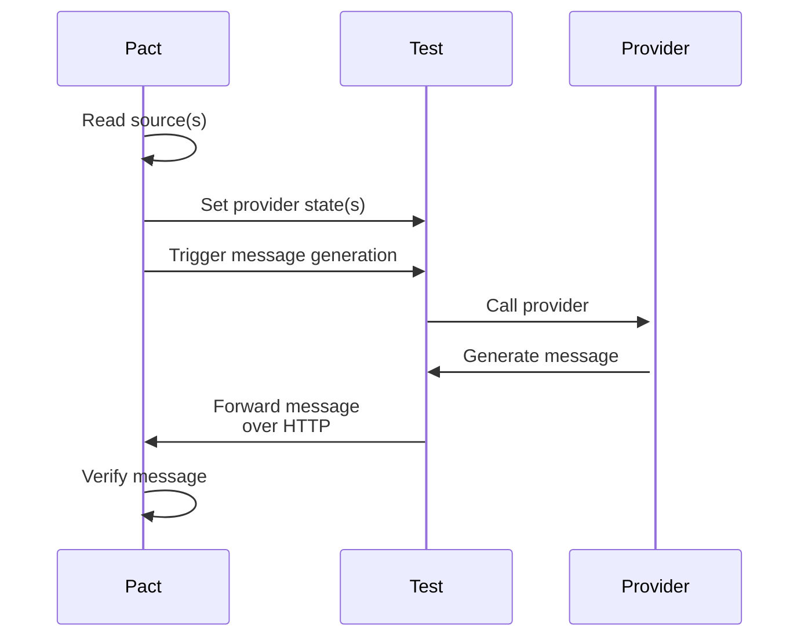

---
authors:
    - JP-Ellis
date:
    created: 2024-07-26
---

# Asynchronous Message Support

We are excited to announce that support for verifying asynchronous message interactions has been added in the recent [release of Pact Python version 2.2.1](https://github.com/pact-foundation/pact-python/releases/tag/v2.2.1). To explore this feature, use the [`pact.v3`][pact.v3] module. A huge shoutout goes to [Val Kolovos](https://github.com/valkolovos) who contributed this feature across two very large PRs ([#714](https://github.com/pact-foundation/pact-python/pull/714) and [#725](https://github.com/pact-foundation/pact-python/pull/725)). This represents a significant step forward in the capabilities of Pact Python and on the road to full support for the Pact specification.

Asynchronous messages play a crucial role in building resilient and scalable systems. They allow services to communicate with each other without blocking, which can be particularly useful when the sender and receiver are not always available at the same time. However, verifying these interactions is challenging due to the wide variety of messaging systems and protocols.

Pact simplifies this process by focusing on the content of the messages rather than their transport mechanisms. This approach allows defining expected message exchanges and verifying their adherence independently of messaging systems and protocols. For a more comprehensive view of non-HTTP contract testing, have a look over at [docs.pact.io](https://docs.pact.io/getting_started/how_pact_works#non-http-testing-message-pact). The Pact specification provides a way to verify these interactions, but until now, Pact Python support for this feature was incomplete at best.

<!-- more -->

We are thrilled about this new feature and eager to see how our community will leverage it in their projects! Please try out asynchronous message support while it's still in preview mode, as your feedback is invaluable in shaping its final release.

Your feedback will help us refine and prefect this feature. You can provide feedback through any of these channels:

-   Report issues on our GitHub page: [Pact Python Issues](https://github.com/pact-foundation/pact-python/issues).
-   Join discussions on GitHub: [Pact Python Discussions](https://github.com/pact-foundation/pact-python/discussions).
-   Connect with us on Slack: [Pact Foundation Slack](https://slack.pact.io/).

Thank you for your continued support!

## Consumer Example

Pact is a consumer-driven contract testing tool, and so the consumer defines the expectations of the message. Within the context of asynchronous messages, the consumer is the service that processes the message and might be referred to as the _subscriber_.

Consider an example where a consumer service is responsible for asynchronously processing requests to delete a user from the database and delete associated files. The Python client might listen for messages from AWS SQS and process them using a function like this:

```python
from typing import Any

import boto3

QUEUE_URL = "https://sqs.us-east-1.amazonaws.com/123456789012/MyQueue"


def delete_user(user_id: str) -> bool:
    # Delete user from database
    # Delete associated files
    return True


def process_message(message: dict[str, Any]) -> bool:
    if message.get("action") == "delete_user":
        user_id = message["user_id"]
        return delete_user(user_id)
    return False


def main():
    sqs = boto3.client("sqs")

    response = sqs.receive_message(QueueUrl=queue_url)
    for message in response.get("Messages", []):
        if process_message(message):
            sqs.delete_message(
                QueueUrl=queue_url,
                ReceiptHandle=message["ReceiptHandle"],
            )
```

In this example, the `process_message` function processes messages from an SQS queue and calls the `delete_user` function to delete the user from the database and associated files. The `main` function listens for messages from the SQS queue and processes them using the `process_message` function.

Here’s an example of a Pact test for this consumer:

```python
import json

from pact.v3 import Pact

from my_consumer import process_message

def handler(body: str | bytes | None, metadata: dict[str, Any]) -> None:
    message = json.loads(body)
    process_message(message)

pact = Pact(
    consumer="deleteUserService",
    provider="someProvider",
).with_specification("V3")  # (1)

(
    pact
    .upon_receiving("a request to delete a user", "Async")
    .with_body(
        json.dumps({
            "action": "delete_user",
            "user_id": "123",
        })
    )  # (2)
)

pact.verify(handler, "Async")
```

1.  Support for asynchronous messages starts in version 3 of the Pact specification.
2.  No `will_respond_with` method exists for asynchronous messages since there’s no response expected.

This example highlights how the verification of asynchronous messages differs from HTTP interaction. As the transport layer is abstracted away, a `handler` function is required to parse the raw message string or bytes, and pass it to the underlying function that processes the message.

The `handler` would also typically be responsible for mocking the underlying systems that the consumer interacts with, such as the database or file system. This allows the consumer to be tested in isolation, without relying on external services. Furthermore, the mocked systems can then be inspected to verify that the consumer has performed the expected actions.

## Provider Example

For context of asynchronous messages, the provider is the service that sends the message and might be referred to as the _publisher_ or _producer_. Since the contract is defined by the consumer, the Pact provider test simply has to verify that the messages it sends meet the expectations of the consumer.

As the underlying protocol is abstracted away, Pact uses a local HTTP server to receive the messages that the provider sends. The provider test for the above consumer might look something like this:

```python
from pact.v3 import Verifier

class Provider:
    """
    A simple HTTP provider that sends messages to the consumer.

    This would typically use the same underlying functions that would generate messages, except that instead of being sent into the message queue, they are sent to the consumer's HTTP server.
    """

provider = Provider()

(
    Verifier()
    .set_info("someProvider", url=provider.url)  # (1)
    .set_source("/path/to/pacts")
    .set_state(provider.state_url)  # (2)
    .add_transport(  # (3)
        protocol="message",
        path="/_pact/message",
    )
 )
```

1.  The provider URL is required, but is only used if the Pact being verified contains both HTTP and message interactions. It is not used for message interactions, and should the Pact not contain any HTTP interactions, the endpoint need not be active.
2.  The provider state URL is required to ensure the provider is in the correct state. If the provider is entirely stateless, this can be omitted.
3.  This path is used by Pact to ensure that the provider is in the correct state before sending the message.

Those familiar with HTTP interactions will notice that the process is very similar, with the key difference of the additional `add_transport` method. This configures a simple HTTP endpoint which Pact can use to prompt the provider to send a specific message. The following sequence diagram illustrates the flow of the provider test:



At present, it is the responsibility of the end user to set up the provider endpoint middle-man to access the message triggers; however, future versions of Pact Python will abstract this away thereby reducing the test boilerplate required. The payloads are:

1.  Trigger from Pact to the provider to generate a message:

    ```http
    POST /_pact/message HTTP/1.1
    Content-Type: application/json

    {
        "description": "a request to delete a user",
    }
    ```

2.  Response expected from the provider:

    ```http
    HTTP/1.1 200 OK
    Content-Type: application/json
    Pact-Message-Metadata: <optional base64 encoded JSON object>

    {
        "action": "delete_user",
        "user_id": "123",
    }
    ```

    Some queueuing systems allow for metadata to be attached to messages and may be required as part of the Pact. If that is the case, the metadata generated by the provider can be passed through the `Pact-Message-Metadata` header as a base-64 encoded string of the underlying JSON object.
