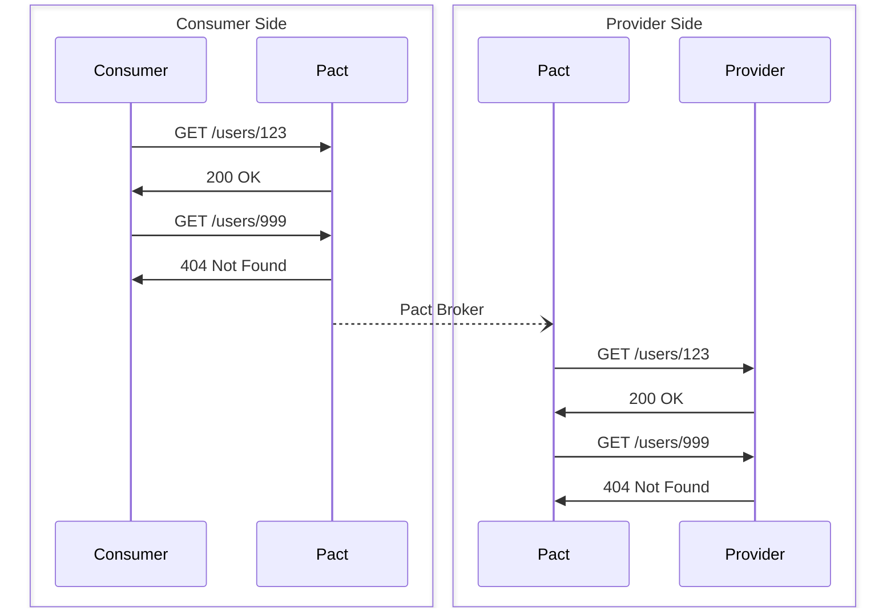

# Consumer Testing

Pact is a consumer-driven contract testing tool. The consumer specifies the expected interactions with the provider, which are used to create a contract. This contract is then used to verify that the provider meets the consumer's expectations.

<!-- markdownlint-disable no-inline-html -->
<div align="center">



</div>
<!-- markdownlint-enable no-inline-html -->

The consumer is the client that makes requests, and the provider is the server that responds. In most cases, the consumer is a front-end application and the provider is a back-end service; however, a back-end service may also require information from another service, making it a consumer of that service.

The core logic is implemented in Rust and exposed to Python through the [core Pact FFI](https://github.com/pact-foundation/pact-reference). This will help ensure feature parity between different language implementations and improve performance and reliability. This also brings compatibility with the latest Pact Specification (v4).

> [!NOTE]
>
> For asynchronous interactions (e.g., message queues), the consumer refers to the service that processes the messages. This is not covered here, but further information is available in the [Message Pact](https://docs.pact.io/getting_started/how_pact_works#non-http-testing-message-pact) section of the Pact documentation.

## Writing the Test

> [!NOTE]
>
> The code below is an abridged version of [this example](./examples/http/requests_and_fastapi/README.md).

### Consumer Client

For example, consider a simple API client that interacts with a user provider service. The client has methods to get, create, and delete users. The user data model is defined using a dataclass.

```python
from dataclasses import dataclass
from datetime import datetime
from typing import Any
import requests

@dataclass()
class User:  # (1)
    id: int
    name: str
    created_on: datetime

class UserClient:
    """Simple HTTP client for interacting with a user provider service."""

    def __init__(self, hostname: str) -> None:  # (2)
        self._hostname = hostname

    def get_user(self, user_id: int) -> User:
        """Get a user by ID from the provider."""
        response = requests.get(f"{self._hostname}/users/{user_id}")
        response.raise_for_status()
        data: dict[str, Any] = response.json()
        return User(  # (3)
            id=data["id"],
            name=data["name"],
            created_on=datetime.fromisoformat(data["created_on"]),
        )
```

1.  The `User` dataclass represents the user data model _as used by the client_. Importantly, this is not necessarily the same as the data model used by the provider. The Pact contract should reflect what the consumer needs, not what the provider actually implements.

2.  The initialiser for the `UserClient` class takes a `hostname` parameter, which is the base URL of the user provider service. This ensures that the client can be easily pointed to the mock service during testing.

3.  Only the fields required by the consumer are included in the `User` dataclass. The provider might return additional fields (e.g., `email`, `last_login`, etc.), but this consumer does not need to know about them and therefore they are ignored in the client implementation.

### Consumer Test

The following is a Pact test for the `UserClient` class defined above. It sets up a mock provider, defines the expected interactions, and verifies that the client behaves as expected.

```python
from pathlib import Path

import pytest
from pact import Pact, match

@pytest.fixture
def pact() -> Generator[Pact, None, None]:  # (1)
    """Set up a Pact mock provider for consumer tests."""
    pact = Pact("user-consumer", "user-provider").with_specification("V4")  # (2)
    yield pact
    pact.write_file(Path(__file__).parent / "pacts")

def test_get_user(pact: Pact) -> None:
    """Test the GET request for a user."""
    response: dict[str, object] = {  # (3)
        "id": match.int(123),
        "name": match.str("Alice"),
        "created_on": match.datetime(),
    }
    (
        pact.upon_receiving("A user request")  # (4)
        .given("the user exists", id=123, name="Alice")  # (5)
        .with_request("GET", "/users/123")  # (6)
        .will_respond_with(200)  # (7)
        .with_body(response, content_type="application/json")  # (8)
    )

    with pact.serve() as srv:  # (9)
        client = UserClient(str(srv.url))  # (10)
        user = client.get_user(123)
        assert user.name == "Alice"
```

1.  A [Pytest fixture](https://docs.pytest.org/en/stable/explanation/fixtures.html) provides a reusable `pact` object for multiple tests. In this case, the fixture creates a [`Pact`][pact.Pact] instance representing the contract between the consumer and provider. The fixture yields the `pact` object to the test function, and after the test completes, writes the generated pact file to the specified directory.

2.  The Pact specification version is set to `"V4"` to ensure compatibility with the latest features and improvements in the Pact ecosystem. Note that this is the default version, so this line is optional unless you want to specify a different version.

3.  The expected response is defined using the `match` module for flexible matching of the response data. Here, the `id` field is expected to be an integer, the `name` field a string, and the `created_on` field a datetime string. The specific values are not important, as long as they match the expected types.

4.  The `upon_receiving` method defines the description of the interaction. This description also uniquely identifies the interaction within the Pact file.

5.  The `given` method sets up the provider state, indicating that the user with ID 123 exists. Pact allows parameters to be passed to the provider state, which can be used to set up the provider in a specific way. Here, the parameters `id=123` and `name="Alice"` are provided, which the provider can use to create the user if necessary.

6.  The `with_request` method defines the expected request that the consumer will make. Here, it specifies that a `GET` request will be made to the `/users/123` endpoint.

7.  The `will_respond_with` method specifies the expected HTTP status code of the response. Here, a `200 OK` status is expected. The `will_respond_with` method also helps separate the request definition from the response definition, improving readability.

8.  The `with_body` method defines the expected body of the response, using the `response` dictionary defined earlier. The `content_type` parameter specifies that the response will be in JSON format.

9.  The `pact.serve()` method starts the mock service, and the `srv` object provides the URL of the mock service. Within this context, any requests made to the mock service will be handled according to the interactions defined on the `pact` object. Once the context is exited, the mock service is stopped, and the interactions are verified to ensure all expected requests were made.

10.  The `UserClient` is instantiated with this URL, and the `get_user` method is called to retrieve the user data. The test asserts that the returned user's name is "Alice".

The test begins with a Pytest fixture that creates a reusable Pact instance representing the contract between `"user-consumer"` and `"user-provider"`. The expected response is defined using flexible matchers (`match.int()`, `match.str()`, `match.datetime()`) to validate data types rather than exact values, making the test more robust against varying response data.

The interaction definition includes a description, provider state parameters, request details, and expected response format. Only the required parts of the interaction are specified, rather than an exhaustive specification. For example, the client will typically add additional headers (e.g., `User-Agent`, `Accept`, etc.) to the request, but these are not necessary for the contract and are therefore omitted. Similarly, the provider's response may include additional fields or headers that the consumer will ignore, so these are also not included in the contract.

 The `pact.serve()` context manager starts a mock provider service that handles requests according to the defined interactions, creating a controlled testing environment. The actual client code is then executed against this mock service, ensuring it makes correct requests and handles responses properly. Once the context is exited, the Pact file is automatically written to the specified directory for later provider verification, completing the consumer-driven contract testing cycle.

> [!WARNING]
>
> A common mistake is to use a generic HTTP client (e.g., `requests`, `httpx`, etc.) to make requests to the mock service within the test. This defeats the purpose of the test, as it does not verify that the client is making the correct requests and handling the responses correctly.

### Multi-Interaction Testing

The mock service can handle multiple interactions within a single test. This is useful when you want to test a sequence of requests and responses. For example, a first request might create a background task, a second request might check the status of that task, and a final request retrieves the result. This flow can be tested in a single test function by defining multiple interactions on the `pact` object:

```python
(
    pact.upon_receiving("A request to create a task")
    .with_request("POST", "/tasks", body={"type": "long_running"})
    .will_respond_with(202)
    .with_header("Location", "/tasks/1/status")
)

(
    pact.upon_receiving("A request to check task status")
    .with_request("GET", "/tasks/1/status")
    .will_respond_with(200)
    .with_body({"status": "completed"})
    .with_headers({
        "Task-ID": "1",
        "Location": "/tasks/1/result",
    })
)

(
    pact.upon_receiving("A request to get task result")
    .with_request("GET", "/tasks/1/result")
    .will_respond_with(200)
    .with_body({"result": "Task completed successfully"})
)
```

When the mock service is started with `pact.serve()`, it will handle requests for all defined interactions, ensuring the client code can be tested against a realistic sequence of operations. Furthermore, for the test to pass, all defined interactions must be exercised by the client code. If any interaction is not used, the test will fail.

## Mock Service

Pact provides a mock service that simulates the provider service based on the defined interactions. The mock service is started when the `pact` object is used as a context manager with `pact.serve()`, as shown in the [consumer test](#consumer-test) example above.

The mock service automatically selects a random free port by default, helping to avoid port conflicts when running multiple tests. You can optionally specify a custom host and port during Pact creation if needed for your testing environment.

```python
with pact.serve(host="localhost", port=1234) as srv:
    client = UserClient(str(srv.url))
    user = client.get_user(123)
```

The mock service offers several important features when building your contracts:

-   It provides a real HTTP server that your code can contact during the test and returns the responses you defined.
-   You provide the expectations for the requests your code will make, and it asserts the contents of the actual requests made against your expectations.
-   If a request is made that does not match one you defined, or if a request from your code is missing, it returns an error with details.

## Broker

The above example showed how to test a single consumer; however, without also testing the provider, the test is incomplete. The Pact Broker is a service that allows you to share and manage your contracts between your consumer and provider tests. It acts as a central repository for your contracts, allowing you to publish contracts from your consumer tests and retrieve them in your provider tests.

Once the tests are complete (and successful), the contracts can be uploaded to the Pact Broker. The provider can then download the contracts and run its own tests to ensure it meets the consumer's expectations.

The Broker CLI is a command-line tool that can be installed through the `pact-python-cli` package, or directly from the [Pact Standalone](https://github.com/pact-foundation/pact-standalone) releases page. It bundles several standalone CLI tools, including the `pact-broker` CLI client.

The general syntax for the CLI is:

```console
pact-broker publish \
    /path/to/pacts/consumer-provider.json \
    --consumer-app-version 1.0.0 \
    --auto-detect-version-properties
```

It expects the following environment variables to be set:

`PACT_BROKER_BASE_URL`

:   The base URL of the Pact Broker (e.g., `https://test.pactflow.io` if using [PactFlow](https://pactflow.io), or the URL to your self-hosted Pact Broker instance).

`PACT_BROKER_USERNAME` / `PACT_BROKER_PASSWORD`

:   The username and password for authenticating with the Pact Broker.

`PACT_BROKER_TOKEN`

:   An alternative to using username and password, this is a token that can be used for authentication (e.g., used with [PactFlow](https://pactflow.io)).

## Pattern Matching

Simple equality checks work for basic scenarios, but realistic tests need flexible matching to handle variable data such as timestamps, IDs, and dynamic content. The `match` module provides matchers that validate data structure and types rather than exact values.

```python
from pact import match

# Instead of exact matches that break easily:
response = {
    "id": 12345,                          # Brittle - specific value
    "email": "user@example.com",          # Fails if email changes
    "created_at": "2024-01-15T10:30:00Z"  # Breaks on different timestamps
}

# Use flexible matchers:
response = {
    "id": match.int(12345),               # Any integer
    "email": match.regex("user@example.com", regex=r".+@.+\..+"),
    "created_at": match.datetime("2024-01-15T10:30:00Z")
}
```

Common matcher types include:

-   **Type matchers**: `match.int()`, `match.str()`, `match.bool()` - validate data types
-   **Pattern matchers**: `match.regex()`, `match.uuid()` - validate specific formats
-   **Collection matchers**: `match.each_like()`, `match.array_containing()` - handle arrays and objects
-   **Date/time matchers**: `match.date()`, `match.time()`, `match.datetime()` - flexible timestamp handling

Matchers ensure your contracts focus on data structure and semantics rather than brittle exact values, making tests more robust and maintainable.

For comprehensive documentation and examples, see the [API Reference](api/match/README.md) and the [`match` module documentation][pact.match]. For more about Pact's matching specification, see [Matching](https://docs.pact.io/getting_started/matching).

## Dynamic Data Generation

While matchers validate that received data conforms to expected patterns, generators produce realistic test data for responses. The `generate` module provides functions to create dynamic values that change on each test run, making your Pact contracts more realistic and robust.

```python
from pact import generate

# Instead of static values in your mock responses
response = {
    "user_id": 123,                    # Always the same
    "session_token": "abc-def-123",    # Predictable
    "created_at": "2024-07-20T14:30:00+00:00"  # Never changes
}

# Use generators for dynamic, realistic data
response = {
    "user_id": generate.int(min=1, max=999999),
    "session_token": generate.uuid(),
    "created_at": generate.datetime("%Y-%m-%dT%H:%M:%S%z")
}
```

Generators are particularly useful when:

-   **Testing with fresh data**: Each test run uses different values, helping catch issues with data handling
-   **Avoiding test pollution**: Dynamic IDs and tokens prevent tests from accidentally depending on specific values
-   **Simulating real conditions**: Generated timestamps, UUIDs, and random numbers better represent actual API behavior
-   **Provider state integration**: Using `generate.provider_state()` to inject values from the provider's test setup

### Common Generators

```python
from pact import generate

response = {
    # Numeric values with constraints
    "user_id": generate.int(min=1, max=999999),
    "price": generate.float(precision=2),  # 2 total digits
    "hex_color": generate.hex(digits=6),   # 6-digit hex code

    # String and text data
    "username": generate.str(size=8),      # 8-character string
    "confirmation": generate.regex(r"[A-Z]{3}-\d{4}"),  # Pattern-based

    # Identifiers
    "session_id": generate.uuid(),         # Standard UUID format
    "simple_id": generate.uuid(format="simple"),  # No hyphens

    # Dates and times
    "created_at": generate.datetime("%Y-%m-%dT%H:%M:%S%z"),
    "birth_date": generate.date("%Y-%m-%d"),
    "start_time": generate.time("%H:%M:%S"),

    # Boolean values
    "is_active": generate.bool(),

    # Provider-specific values
    "server_url": generate.mock_server_url(),
    "dynamic_value": generate.provider_state("${expression}")
}
```

### Combining Matchers and Generators

Matchers and generators work together to create flexible, realistic contracts. Use matchers to validate incoming data and generators to produce dynamic response data:

```python
# Request validation with matchers
request_body = {
    "email": match.regex("user@example.com", regex=r".+@.+\..+"),
    "age": match.int(25, min=18, max=100),
    "preferences": match.array_containing([match.str("notifications")])
}

# Response generation with dynamic data
response_body = {
    "id": generate.int(min=100000, max=999999),
    "email": match.str("user@example.com"),  # Echo back the input
    "verification_token": generate.uuid(),    # Fresh token each time
    "created_at": generate.datetime("%Y-%m-%dT%H:%M:%S%z"),
    "profile_url": generate.mock_server_url(
        example="/profiles/12345",
        regex=r"/profiles/\d+"
    )
}
```

This approach ensures your tests validate the correct data structures while generating realistic, varied response data that better simulates real-world API behaviour.
