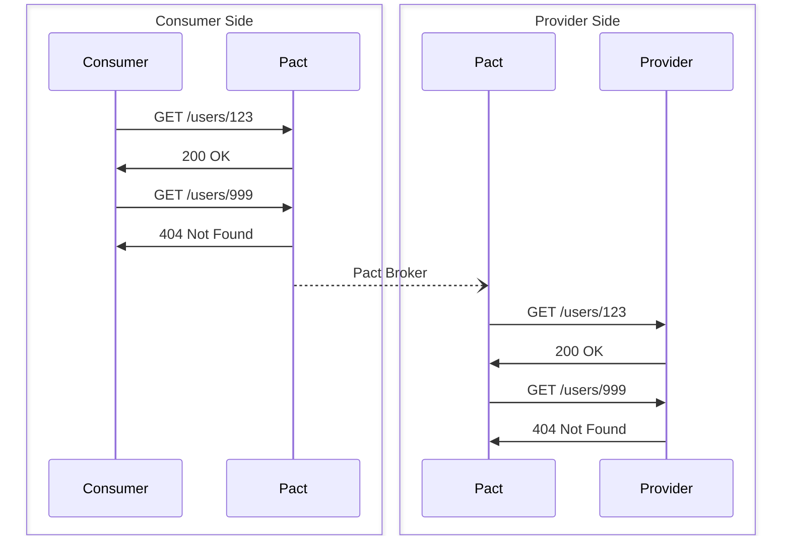

# Provider Testing

Pact is a consumer-driven contract testing tool. The consumer specifies the expected interactions with the provider, which are used to create a contract. This contract is then used to verify that the provider behaves as expected.

<!-- markdownlint-disable no-inline-html -->
<div align="center">



</div>
<!-- markdownlint-enable no-inline-html -->

The provider verification process works by replaying the interactions from the consumer against the provider and checking that the responses match what was expected. This is done using the Pact files created by the consumer tests, either by reading them from the local file system or by fetching them from a Pact Broker.

The core verification logic is implemented in Rust and exposed to Python through the [core Pact FFI](https://github.com/pact-foundation/pact-reference). This will help ensure feature parity between different language implementations and improve performance and reliability. This also brings compatibility with the latest Pact Specification (v4).

## Verifying Pacts

Pact Python's [`Verifier`][pact.verifier.Verifier] class provides the mechanism to fetch and verify Pacts against your provider application, while also facilitating provider state management and result publishing.

### Basic Usage

You can verify Pacts from a local directory as follows:

```python
from pact import Verifier

def test_provider():
    """Test the provider against the consumer contract."""
    verifier = (
        Verifier("my-provider")  # Provider name
        .add_source("./pacts/")  # Directory containing Pact files
        .add_transport(url="http://localhost:8080")  # Provider URL
    )

    verifier.verify()
```

The `Verifier` inspects the specified directory for Pact files matching the provider name, and verifies each interaction against the running provider at the given URL.

### Verifying from a Pact Broker

Although local Pact files are useful for quick tests, in most cases you will want to verify Pacts from a Pact Broker. In this case, specify the broker URL and any necessary authentication:

```python
from pact import Verifier

def test_provider_from_broker():
    """Test the provider against contracts from a Pact Broker."""
    verifier = (
        Verifier("my-provider")
        .add_transport(url="http://localhost:8080")
        .broker_source(
            "https://my-broker.example.com",
            username="broker-username",  # or use token="bearer-token"
            password="broker-password",
        )
    )

    verifier.verify()
```

For advanced broker configurations, use the selector builder pattern to filter which Pacts to verify:

```python
from pact import Verifier

def test_provider_with_selectors():
    """Test with advanced broker selectors."""
    verifier = (
        Verifier("my-provider")
        .add_transport(url="http://localhost:8080")
        .broker_source(
            "https://my-broker.example.com",
            token="bearer-token",
            selector=True,  # Enable selector builder
        )
        .include_pending()  # Include pending pacts
        .include_wip_since("2023-01-01")  # Include WIP pacts since date
        .provider_tags("main", "develop")
        .consumer_tags("production", "main")
        .build()  # Build the selector
    )

    verifier.verify()
```

More information on the selector options is available in the [API reference][pact.verifier.BrokerSelectorBuilder].

### Publishing Results

To publish verification results to the Broker:

```python
verifier = (
    Verifier("my-provider")
    .add_transport(url="http://localhost:8080")
    .broker_source("https://my-broker.example.com", token="bearer-token")
)

if "CI" in os.environ:
    verifier.set_publish_options(  # (1)
        version="1.2.3",
        branch="main",
        tags=["production"],
    )

verifier.verify()
```

1.  While we use static values here, in practice, you would use dynamic values taken from your CI/CD environment, or helper function to extract version information from your source control system.

## Configuration Options

### Filtering

Filter interactions to verify:

```python
verifier = (
    Verifier("my-provider")
    .filter(description="user.*", state="user exists")  # Regex filters
    .filter_consumers("mobile-app", "web-app")  # Specific consumers only
)
```

### Custom Headers

While the Pact contract should define all necessary request and response details, there are cases where you may need to add custom headers to every request made to the provider during verification (e.g., for authentication).

```python
verifier = (
    Verifier("my-provider")
    .add_custom_header("Authorization", "Bearer token123")
    .add_custom_headers({
        "X-Debug-Mode": "true",
        "X-Debug-Secret": "123-abc",
    })
)
```

## Provider States

Provider states are a crucial concept in Pact testing. When a consumer creates a Pact, it specifies not just what request to make, but also what state the provider should be in when that request is made. This is expressed using the `.given(...)` method in consumer tests.

For example, if a consumer test includes `given("user 123 exists")`, it means the provider must have a user with ID 123 in its system when the interaction is verified. A better approach is to parameterise the provider state instead of hard-coding values within the state name, such as `given("user exists", id=123, name="Alice")`.

For these provider states to be meaningful, the provider tests need to set up the appropriate state before each interaction is verified. This is done using state handler methods. Optionally, these handlers can also perform teardown actions after the interaction is verified, which is useful for cleaning up test data.

### State Handler Methods

The `Verifier` class provides three ways to handle provider states:

1.  **Function-based handlers** - A single function handles all states
2.  **Dictionary-based handlers** - Map state names to specific functions
3.  **URL-based handlers** - External HTTP endpoint manages states

> [!WARNING]
>
> If using mocking libraries, the function- and dictionary-based handlers must run in the same process as the provider application. For example, using `threading.Thread` to run the provider in a separate thread of the same process is acceptable, but using `multiprocessing.Process` to run the provider in a separate process will not work.

### Function-Based State Handler

A single function can handle all provider states:

```python
from pact import Verifier
from typing import Literal, Any

def handle_provider_state(
    state: str,
    action: Literal["setup", "teardown"],
    parameters: dict[str, Any] | None,
) -> None:
    """Handle all provider state changes."""
    parameters = parameters or {}
    if state == "user exists":
        if action == "setup":
            return create_user(
                parameters.get("id", 123),
                name=parameters.get("name", "Alice"),
            )
        if action == "teardown":
            return delete_user(parameters.get("id", 123))

    if state == "no users exist":
        if action == "setup":
            return clear_all_users()

    msg = f"Unknown state/action: {state}/{action}"
    raise ValueError(msg)

verifier = (
    Verifier("my-provider")
    .add_transport(url="http://localhost:8080")
    .add_source("./pacts/")
    .state_handler(handle_provider_state, teardown=True)
)

verifier.verify()
```

### Dictionary-Based State Handler (Recommended)

Map specific state names to dedicated handler functions:

```python
from pact import Verifier
from typing import Literal, Any

def mock_user_exists(
    action: Literal["setup", "teardown"],
    parameters: dict[str, Any] | None,
) -> None:
    """Mock the provider state where a user exists."""
    parameters = parameters or {}
    user_id = parameters.get("id", 123)

    if action == "setup":
        # Set up the user in your test database/mock
        return UserDb.create(User(
            id=user_id,
            name=parameters.get("name", "Test User"),
            email=parameters.get("email", "test@example.com"),
        ))
    if action == "teardown":
        # Clean up after the test
        return UserDb.delete(user_id)

def mock_user_does_not_exist(
    action: Literal["setup", "teardown"],
    parameters: dict[str, Any] | None,
) -> None:
    """Mock the provider state where a user does not exist."""
    parameters = parameters or {}
    user_id = parameters.get("id", 123)

    if action == "setup" and user_id:
        # Ensure the user doesn't exist
        if UserDb.get(user_id):
            UserDb.delete(user_id)

# Map state names to handler functions
state_handlers = {
    "user exists": mock_user_exists,
    "user 123 exists": mock_user_exists,
    "user does not exist": mock_user_does_not_exist,
}

verifier = (
    Verifier("my-provider")
    .add_transport(url="http://localhost:8080")
    .add_source("./pacts/")
    .state_handler(state_handlers, teardown=True)
)

verifier.verify()
```

### URL-Based State Handler

This approach relies on the provider exposing an HTTP endpoint to manage provider states. This can be necessary if the handler logic cannot be implemented in Python (for example, if the provider is written in a different language).

```python
verifier = (
    Verifier("my-provider")
    .add_transport(url="http://localhost:8080")
    .add_source("./pacts/")
    .state_handler(
        "http://localhost:8080/_pact/setup",  # Your state setup endpoint
        teardown=True,
        body=True,  # Send state info in request body
    )
)
```

The state setup endpoint should handle POST requests with the state information if `body=True` is set; otherwise, the state information will be passed through query parameters and headers.
