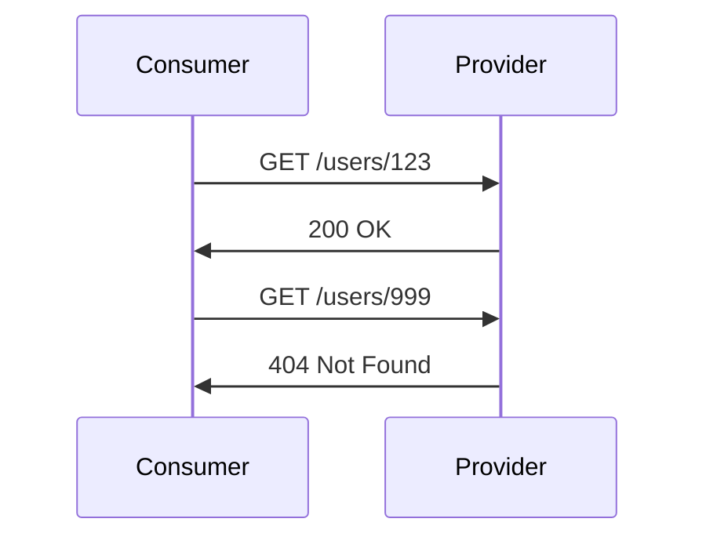
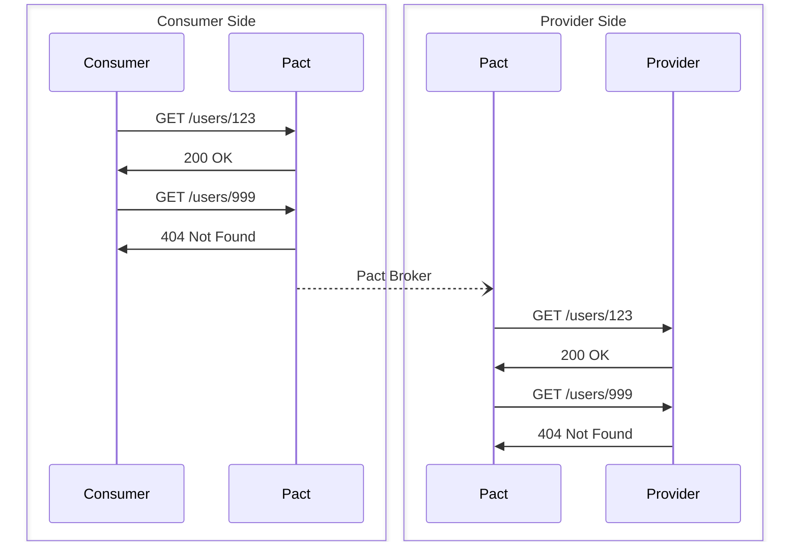

# Examples

This directory contains an end-to-end example of using Pact in Python. While
this document and the documentation within the examples themselves are intended
to be mostly self-contained, it is highly recommended that you read the [Pact
Documentation](https://docs.pact.io/) as well.

Assuming you have [hatch](https://hatch.pypa.io/latest/) installed, the example
suite can be executed with:

```sh
hatch run example
```

The code within the examples is intended to be well documented and you are
encouraged to look through the code as well (or submit a PR if anything is
unclear!).

## Overview

Pact is a contract testing tool. Contract testing is a way to ensure that
services (such as an API provider and a client) can communicate with each other.
This example focuses on HTTP interactions, but Pact can be used to test more
general interactions as well such as through message queues.

An interaction between a HTTP client (the _consumer_) and a server (the
_provider_) would typically look like this:

<div align="center">



</div>

To test this interaction naively would require both the consumer and provider to
be running at the same time. While this is straightforward in the above example,
this quickly becomes impractical as the number of interactions grows between
many microservices. Pact solves this by allowing the consumer and provider to be
tested independently.

Pact achieves this be mocking the other side of the interaction:

<div align="center">



</div>

In the first stage, the consumer defines a number of interactions in the form
below. Pact sets up a mock server that will respond to the requests as defined
by the consumer. All these interactions, containing both the request and
expected response, are all sent to the Pact Broker.

> Given {provider state} \
> Upon receiving {description} \
> With {request} \
> Will respond with {response}

In the second stage, the provider retrieves the interactions from the Pact
Broker. It then sets up a mock client that will make the requests as defined by
the consumer. Pact then verifies that the responses from the provider match the
expected responses defined by the consumer.

In this way, Pact is consumer driven and can ensure that the provider is
compatible with the consumer. While this example showcases both sides in Python,
this is absolutely not required. The provider could be written in any language,
and satisfy contracts from a number of consumers all written in different
languages.

### Consumer

The consumer in this example is a simple Python script that makes a HTTP GET
request to a server. It is defined in [`src/consumer.py`](src/consumer.py). The
tests for the consumer are defined in
[`tests/test_00_consumer.py`](tests/test_00_consumer.py). Each interaction is
defined using the format mentioned above. Programmatically, this looks like:

```py
expected: dict[str, Any] = {
    "id": Format().integer,
    "name": "Verna Hampton",
    "created_on": Format().iso_8601_datetime(),
}
(
    pact.given("user 123 exists")
    .upon_receiving("a request for user 123")
    .with_request("get", "/users/123")
    .will_respond_with(200, body=Like(expected))
)
# Code that makes the request to the server
```

### Provider

This example showcases to different providers, one written in Flask and one
written in FastAPI. Both are simple Python web servers that respond to a HTTP
GET request. The Flask provider is defined in [`src/flask.py`](src/flask.py) and
the FastAPI provider is defined in [`src/fastapi.py`](src/fastapi.py). The
tests for the providers are defined in
[`tests/test_01_provider_flask.py`](tests/test_01_provider_flask.py) and
[`tests/test_01_provider_fastapi.py`](tests/test_01_provider_fastapi.py).

Unlike the consumer side, the provider side is responsible to responding to the
interactions defined by the consumers. In this regard, the provider testing
is rather simple:

```py
code, _ = verifier.verify_with_broker(
    broker_url=str(broker),
    published_verification_results=True,
    provider_states_setup_url=str(PROVIDER_URL / "_pact" / "provider_states"),
)
assert code == 0
```

The complication comes from the fact that the provider needs to know what state
to be in before responding to the request. In order to achieve this, a testing
endpoint is defined that sets the state of the provider as defined in the
`provider_states_setup_url` above. For example, the consumer requests has _Given
user 123 exists_ as the provider state, and the provider will need to ensure
that this state is satisfied. This would typically entail setting up a database
with the correct data, but it is advisable to achieve the equivalent state by
mocking the appropriate calls. This has been showcased in both provider
examples.

### Broker

The broker acts as the intermediary between these test suites. It stores the
interactions defined by the consumer and makes them available to the provider.
Once the provider has verified that it satisfies all interactions, the broker
also stores the verification results. The example here runs the open source
broker within a Docker container. An alternative is to use the hosted [Pactflow
service](https://pactflow.io).
