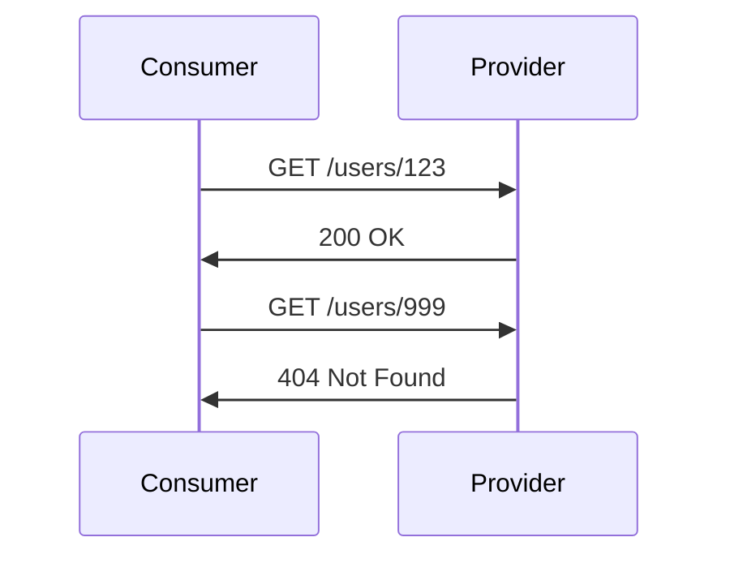
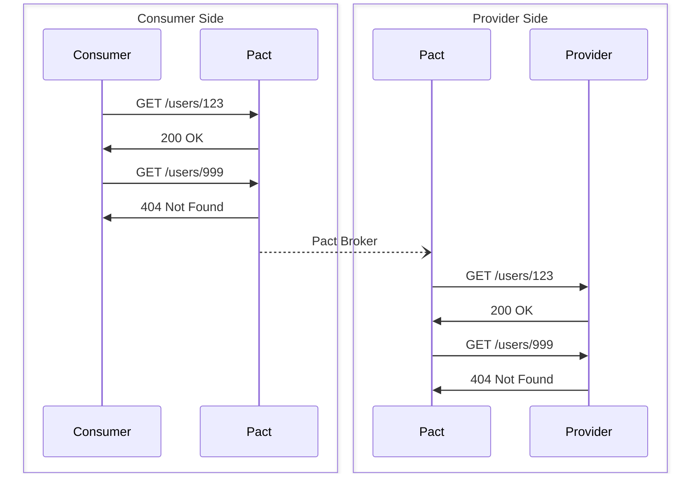

# Examples

This directory contains examples demonstrating how to use Pact in Python for various testing scenarios. While this document and the documentation within the examples themselves are intended to be mostly self-contained, it is highly recommended that you read the [Pact Documentation](https://docs.pact.io/) as well.

Each example is self-contained with its own dependency management using a `pyproject.toml` file. This allows you to run examples independently without affecting your global Python environment or other examples.

The code within the examples is intended to be well-documented and you are encouraged to look through the code as well (or submit a PR if anything is unclear!).

## Available Examples

### HTTP Examples

#### [aiohttp and Flask](./http/aiohttp_and_flask/README.md)

-   **Location**: `examples/http/aiohttp_and_flask/`
-   **Consumer**: aiohttp-based HTTP client
-   **Provider**: Flask-based HTTP server

#### [requests and FastAPI](./http/requests_and_fastapi/README.md)

-   **Location**: `examples/http/requests_and_fastapi/`
-   **Consumer**: requests-based HTTP client
-   **Provider**: FastAPI-based HTTP server

### Message Examples

-   **Location**: `examples/message/`
-   **Status**: 🚧 To be updated

### Plugin Examples

-   **Location**: `examples/plugins/`
-   **Status**: 🚧 To be updated

## Running Examples

Each example can be run independently. Navigate to the specific example directory and use your preferred dependency manager.

## Overview

Pact is a contract testing tool. Contract testing is a way to ensure that services (such as an API provider and a client) can communicate with each other. An interaction between a _consumer_ (i.e., a HTTP client, mobile app, website, microservice, etc.) and a _provider_ (i.e., a web server, microservice, etc.) would typically look like this:

<!-- markdownlint-disable no-inline-html -->

<!-- markdownlint-enable no-inline-html -->

Pact allows for each side of the interaction to be tested independently. Pact achieves this by mocking the other side of the interaction:

<!-- markdownlint-disable no-inline-html -->

<!-- markdownlint-enable no-inline-html -->

Pact is **consumer driven**. This means that the consumer is responsible for defining the interactions it expects from the provider through the pattern of

<!-- markdownlint-disable no-inline-html -->
> Given {provider state}  
> Upon receiving {description}  
> With {request}  
> Will respond with {response}  
<!-- markdownlint-enable no-inline-html -->

When the consumer tests are executed, a Pact mock server is set up that will respond to the requests as defined by the consumer. When the consumer tests are merged into the main branch, the Pact contract is sent to the Pact Broker.

When the provider tests are executed, all contracts are retrieved from the Pact Broker. The provider then sets up a mock client that will make the requests as defined by the consumer. Pact then verifies that the responses from the provider match the expected responses defined by the consumer.

In this way, Pact is consumer-driven and can ensure that the provider is compatible with the consumer. While the examples showcase both sides in Python, this is absolutely not required. The provider could be written in any language, and satisfy contracts from a number of consumers all written in different languages.

## Consumer

Consumer tests define the contract by specifying the interactions the consumer expects from the provider. These tests focus on the consumer's perspective and needs.

### Principles

-   **Core interactions are defined**: Only test the interactions your consumer actually uses
-   **Minimal requests and responses**: Define only the required headers, query parameters, and body fields that your consumer needs
-   **Consumer-driven**: The consumer decides what it needs from the provider, not what the provider offers
-   **Independent testing**: Consumer tests run against a Pact mock provider, not the real provider

### Best Practices

-   If your consumer doesn't use a field from the provider's response, it should be safe for the provider to remove that field
-   Use Pact matchers to make contracts flexible (e.g., `match.integer` instead of hardcoded values)
-   Test error scenarios your consumer needs to handle (4xx, 5xx responses)
-   Keep contracts focused on business logic, not implementation details

### Contract Publishing

When consumer tests pass, the generated Pact contracts should be published to a Pact Broker. This makes them available for provider verification and enables the consumer-driven workflow.

## Provider

Provider tests verify that the actual provider implementation satisfies all contracts defined by its consumers. These tests ensure the provider can fulfill its obligations in the consumer-provider relationship.

### Core Principles

-   **Verify all consumer contracts**: The provider must satisfy every interaction defined by all its consumers
-   **Provider state management**: Set up the correct application state before each interaction is verified
-   **Real provider testing**: Verification runs against the actual provider implementation, not mocks
-   **Fail fast**: Any contract violation should cause provider tests to fail immediately

### Provider States

Provider states are a key concept for ensuring your provider is in the correct state before an interaction:

-   **Setup**: Use provider state callbacks to configure your application (e.g., create test data)
-   **Isolation**: Each interaction should have a clean, predictable state
-   **Mocking**: Mock external dependencies (databases, APIs) rather than requiring real infrastructure

### Contract Retrieval

Provider tests retrieve contracts from the Pact Broker and verify them against the running provider:

-   Use selectors to choose which contracts to verify (e.g., latest, main branch, specific versions)
-   Configure which consumer versions to verify based on your deployment strategy
-   Publish verification results back to the broker

## Broker

The Pact Broker acts as the central contract repository and coordination point between consumers and providers. It stores contracts, verification results, and provides tools for managing the contract testing workflow.

### How It Works

-   **Contract storage**: Consumers publish their contracts to the broker after successful test runs
-   **Contract retrieval**: Providers fetch relevant contracts from the broker for verification
-   **Verification results**: Providers publish verification results back to the broker
-   **Visibility**: Teams can see which contracts exist, their verification status, and compatibility matrix

### Publishing Contracts

Consumers should publish contracts when:

-   Consumer tests pass successfully
-   Changes are merged to main branch
-   Deploying to production environments

### Retrieving Contracts

Providers can use selectors to determine which contracts to verify:

-   **Latest**: Most recent contract from each consumer
-   **Branch-based**: Contracts from specific git branches (e.g., `main`, `develop`)
-   **Environment-based**: Contracts from consumers deployed to specific environments
-   **Tag-based**: Contracts tagged with specific labels

### Versioning Strategy

-   Use semantic versioning or commit SHA for contract versions
-   Tag contracts when deploying to different environments
-   Use "can-i-deploy" checks before releasing to ensure compatibility
